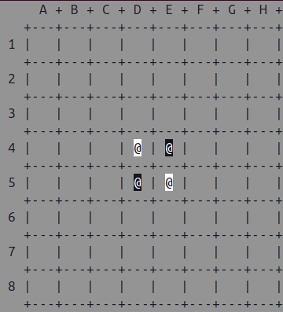

# Othello AI - Minimax & Alpha-Beta

Este proyecto es una implementación en C++ del juego de mesa Othello (Reversi), que enfrenta a dos agentes de Inteligencia Artificial: Alice y Bob.

El núcleo del proyecto se centra en la toma de decisiones mediante algoritmos de búsqueda adversarial (Minimax y Poda Alpha-Beta) con funciones de evaluación heurística personalizadas.

<p align="center">
  
  
  
</p>

* Las fichas negras corresponden a Alice.
* Las fichas blancas corresponden a Bob.
* En esta configuración por defecto, la ganadora es Alice 37 a 27.

Este proyecto fue desarrollado para la asignatura de Sistemas Inteligentes de la Universitat de València en 2023.

## Características

* **Algoritmos de búsqueda:** 
    * **Minimax:** Exploración completa del árbol de juego hasta una profundidad determinada.
    * **Alpha-Beta Pruning:** Optimización del algoritmo Minimax para podar ramas irrelevantes y mejorar la eficiencia.
* **Heurísticas diferenciadas:** Estrategias de evaluación distintas para cada jugador (Posicional vs Movilidad).
* **Visualización del tablero en consola:** Interfaz de texto con soporte de colores ANSI.

## Instalación

**Requisitos:** 
* Compilador C++ con estándares modernos (g++).
* Entorno terminal con soporte de colores ANSI.

### 1. Clonar el repositorio

```bash
git clone https://github.com/IvaanEscudero/Othello-AI
```

### 2. Compilar el programa

```bash
# Limpiar archivos de compilaciones anteriores
make clean

# Compilar el proyecto
make
```

### 3. Ejecutar el programa

```bash
./otello_test
```
* Por defecto, el programa mostrará el tablero en cada turno, indicando el movimiento realizado, la puntuación heurística calculada y el estado final del juego.
* **Nota:** Puedes ajustar la profundidad de búsqueda modificando la variable `chosen_depth` en el archivo `otello_test.cpp` (por defecto es 2).

## IA y Estrategias

### 1. Algoritmos de Búsqueda:
* El proyecto implementa 2 estrategias principales en `heuristic.cpp`:
    * **Minimax:** Evalúa todos los nodos posibles hasta la profundidad límite.
    * **Alpha-Beta:** Reduce el espacio de búsqueda ignorando ramas que no afectarán la decisión final (implementado en `alphabeta.cpp`, intercambiable en el `main`).

### 2. Funciones heurísticas (`h`)
* La función de evaluación `h(Player pl, Board d)` determina qué tan bueno es un estado del tablero para un jugador.
    * **Alice (Posicional):**
        * Prioriza ocupar las esquinas, ya que son posiciones estables que no pueden ser flanqueadas.
        * Penaliza las casillas adyacentes a las esquinas para evitar entregar la esquina al oponente.
        * Bonifica los bordes y el centro.
    * **Bob (Movilidad):**
        * Se enfoca en restringir las opciones del oponente.
        * Calcula el puntuaje basándose en la inversa de la cantidad de movimientos válidos del oponente: `1 / (2 ^ num_movimientos_oponente)`.
        * Busca llevar al oponente a estados donde tenga pocas o nulas opciones de movimiento.

## Estructura del proyecto

* **otello_test.cpp:** Archivo principal. Gestiona el bucle del juego y alterna turnos.
* **otello.cpp / .h:** Lógica del juego. Define el tablero `Board`, las fichas, validación de movimientos y renderizado.
* **minimax.cpp / .h:** Implementación del algoritmo `Minimax` estándar.
* **alphabeta.cpp / .h:** Implementación del algoritmo `Minimax` con poda `Alpha-Beta`.
* **heuristic.cpp / .h:** Contiene la lógica de evaluación estática del tablero para Alice y Bob.
* **makefile:** Automatización de la compilación del programa.

## Notas

* Para cambiar entre usar `Minimax` o `Alpha-Beta` en la partida, debes editar el archivo `otello_test.cpp`:

```bash
// En otello_test.cpp, dentro del bucle while:

// Para usar Minimax (Actual):
score = Minimax(pl, b, chosen_depth, true, mv);

// Para usar Alpha-Beta (Optimizado):
// float alpha = -FLT_MAX;
// float beta = FLT_MAX;
// score = Alphabeta(pl, b, chosen_depth, true, mv, alpha, beta);
```